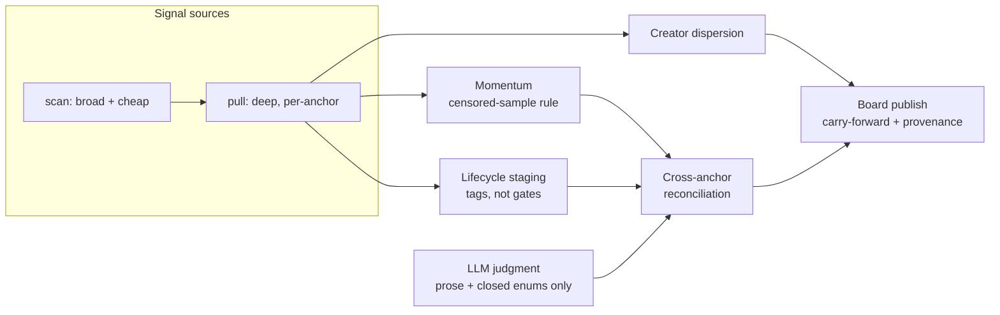

# trend-radar

Evidence-first trend detection for short-video platforms: pluggable signal
sources, lifecycle staging, creator-breadth verdicts, and a publishing layer
whose first rule is *never invent a number*.

```
npm install
npm run demo     # end-to-end on synthetic data — no credentials, no network
npm test
```

## What this is

A trend radar answers a deceptively hard question: *of everything moving on a
short-video platform right now, what is actually a trend, where is it in its
life, and how sure are we?* This repository is a self-contained, re-authored
demonstration of the architecture and the core algorithms from a production
system I designed, built, and operated for a brand social team. The
production deployment — its data, integrations, client configuration, and
operational history — is private and is not included here.

## Where the data comes from

The pipeline is written against a single seam, [`SignalSource`](src/sources/types.ts):
a broad cheap `scan()` plus a narrow expensive `pull(anchorId)`. A deployment
wires in whatever sources it is licensed and permitted to use — official
platform APIs such as the [TikTok Business API](https://business-api.tiktok.com)
(an approved-developer integration; a stub adapter marks the seam in
[`tiktok-business.ts`](src/sources/tiktok-business.ts)), first-party analytics
exports, or licensed data providers.

This repository ships exactly one concrete source: a
[synthetic generator](src/sources/mock.ts) with a seeded PRNG and
`demo-sound-*` IDs, so the entire pipeline runs end-to-end offline. **No real
platform data appears anywhere in this repository.**

## Architecture



The two-collector split is the key mental model: a wide shallow scan decides
*what deserves attention*, and a narrow deep pull spends the budget only on
those anchors. Everything downstream consumes the same `Anchor` shape
regardless of source.

## The parts worth reading

| Module | The idea |
| --- | --- |
| [`pipeline/momentum.ts`](src/pipeline/momentum.ts) | **Censored-sample rule.** When a source caps its pull, share metrics describe the returned slice, not the trend. On capped pulls a cross-run observation counter becomes the authority — in both directions — and the published figure is labeled `[counter]`. |
| [`pipeline/lifecycle.ts`](src/pipeline/lifecycle.ts) | **Stages are tags, never gates.** Rising / peaking / cooling / evergreen describe a trend; they never discard one. Evergreen library sounds are stock, not dying adoption curves, so flat ≠ cooling for them. |
| [`pipeline/carry.ts`](src/pipeline/carry.ts) | **Board carry-forward.** Chart surfaces churn daily; board membership is lifecycle-driven. Cards persist through surface churn until the evidence ends them — and a carried card may never claim "rising". |
| [`pipeline/reconcile.ts`](src/pipeline/reconcile.ts) | **Downward-only reconciliation.** Anchor evidence can refute a topic's "rising" read (demote to peaking, with an auditable `stageWitness`) but can never promote one. |
| [`judgment/boundary.ts`](src/judgment/boundary.ts) | **LLM authority boundary.** The model writes prose and picks from closed enums. It is never the source of record for URLs, IDs, counts, or provenance — those are measured or they render "—". |
| [`publish/board.ts`](src/publish/board.ts) | **Honesty at render time.** Unknown renders "—", never 0; every figure prints with the basis that produced it. |

Deeper write-ups: [docs/ARCHITECTURE.md](docs/ARCHITECTURE.md) and
[docs/DESIGN-PRINCIPLES.md](docs/DESIGN-PRINCIPLES.md).

## Demo output

```
Trend                  Stage      Momentum             Views/wk        Creator breadth
---------------------  ---------  -------------------  --------------  -------------------------
Synthetic Riser        rising     38%/day              5.1M views/wk   dispersed (240 creators)
Synthetic Peaker       peaking    0.8%/day             45.4M views/wk  dispersed (1900 creators)
Synthetic Evergreen    evergreen  0.3%/day             21.0M views/wk  dispersed (5200 creators)
Synthetic Capped Pull  rising     23.4%/day [counter]  —               dispersed (60 creators)
```

The capped-pull row is the censored-sample rule at work in the *promote*
direction: its reported series is flat noise, but the observation counter
shows real growth — so it reads rising, from the honest instrument, labeled.

## License

MIT
